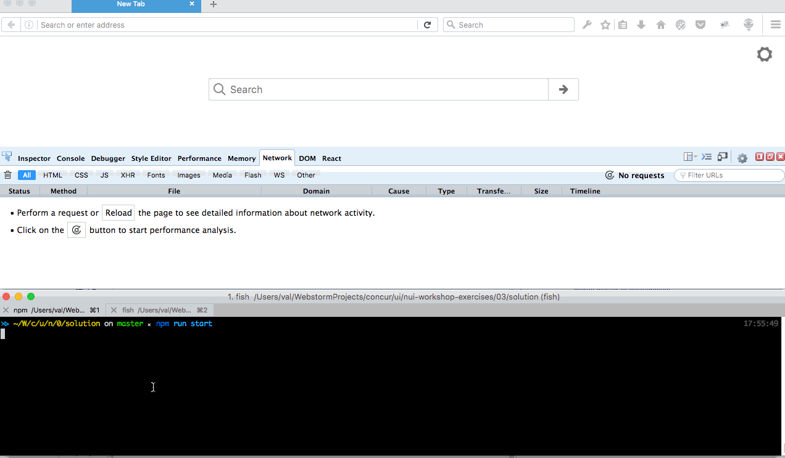

# Introducing WebPack and fetch

## Tasks:
- create components/Page.js with fetch locations service, and rendering locations list as <ul>
- create config for bundling the file



## Steps:

#### - install webpack package
```
cd nui-workshop-exercises
npm install --save webpack
```

### - make sure build scripts are in package.json file
- Add build scripts to scripts section
- as this is an example workshop, for each exercise to share
- same node_modules, make sure scripts are executed from ../../node_modules/.bin
```json
scripts: {
    "build": "../../node_modules/.bin/babel src --out-dir=lib",
    "prepack": "npm run build",
    "pack": "../../node_modules/.bin/webpack --config=webpack.config.babel.js",
    "prestart": "npm run pack",
    "start": "node lib/server.js",
}
```


### - create webpack.config.babel.js file

### change static/index.html so serve bundle.js file from dist/ folder


### Create file components/LocationsPage.js
 - implement fetch of locations from http://localhost:3000/locations
 - render list of locations as UL list (no react, use innetHTML)

### import components/LocationsPage.js into app.js
- call imported function

### run pack command
```
npm run pack
```
- malke sure bundle.js is created in your dist/ folder

### add dist to express static folder
 - in src/server.js add static replace static from /lib to /dist

### kickoff the server
```
npm run start
```
and see that http://localhost:3000/static, http://localhost:3000/locations?num=2 still work
