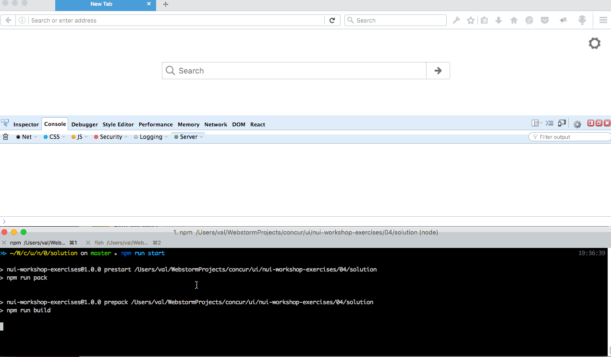

### Introducing React

## Activity
- Rewrite app.js uising react components (LocationList)
- Create a <Location > component that renders each location.
- Move fetch into componentDidMount, puts locations in state.
- Add conditional field for ‘location size’ numEmpolyees > 100 ? “large” : “small”
- Implement an ‘add new location’ form which uses the POST from previous exercise.




## Steps

#### - install react and react-dom packages

```
cd nui-workshop-exercises
npm install --save react react-dom
```

#### - install babel-preset-react as dev-dependency

```
cd nui-workshop-exercises
npm install --save-dev react babel-preset-react
```

#### - make sure "react" preset is added to .babelrc

#### - create Location Component
 - ./components/Location.jsx
 - should accept location as a property
 - should use conditional rendering (big or small based
     on number of employees)

 ### create components/LocationsForm.jsx

 ### create components/LocationsList.jsx
- assume locations list is coming to this component as part of properties
-
 ### create components/LocationsPage.jsx
 - rename components/LocationsPage.js to components/LocationsPage.jsx and rewrite  it to react.
 - make locations fetch in onComponentDidMount of this component


 ### fix app.js
  - make it Render LocationsList component.

http://localhost:3000/static/
