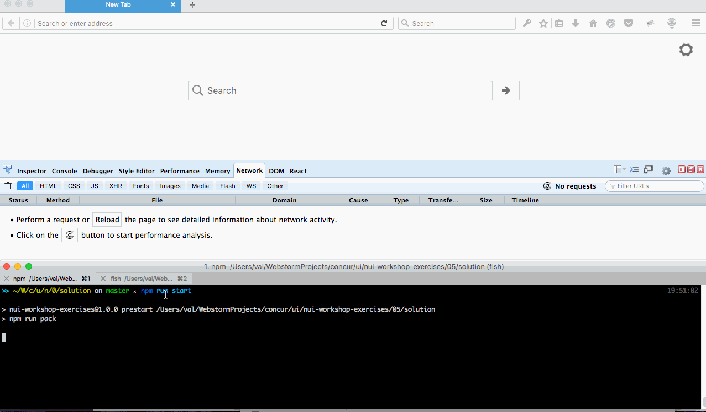

# Introducing React router

## Activity:

- Create 2 routes: 1 for list locations (IndexPage), 1 for add new location.  
- Move add locations form into new route, replace with Link on list locations page.

## Bonus:
- use code splitting for routes



## Steps:

#### - install react-router
```
cd nui-workshop-exercises
npm install --save react-router
```

#### - Create page components/Root.jsx with routes

#### - Change app.js
- change app.js to load component created in components/Root.jsx

#### - change LocationPage.jsx
- convert it to navigation with two links and just render content.
