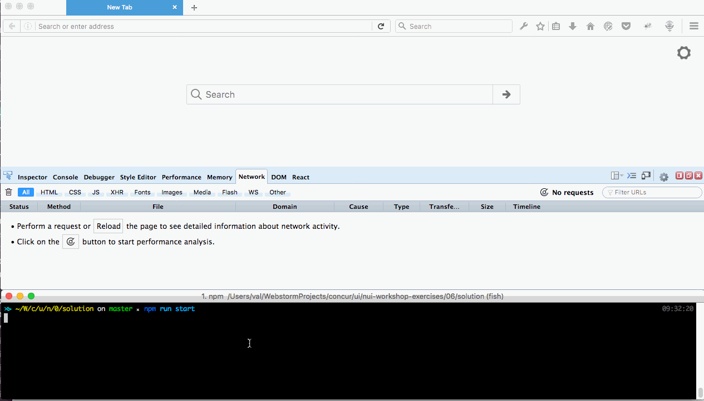

#Introducing Redux

## Activity:
- Rewrite locations app to use redux to keep the list of locations.



## Bonus:  Implement delete location

## Steps

#### - install redux packages
```
cd nui-workshop-exercises
npm install --save redux react-redux redux-thunk
```

#### - install redux devDependencies
```
cd nui-workshop-exercises
npm install --save-dev redux-devtools redux-devtools-dock-monitor redux-devtools-log-monitor redux-logger
```
#### - create src/containers/DevTools.jsx

#### - create src/modules/locations.js
- create actions and reducer for get location list and add location

#### - create src/containers/LocationForm.jsx
 - define what actions and data is coming from redux store
 - and wrap components/LocationForm into connect component.

#### - create src/containers/LocationsList.jsx
- define what actions and data is coming from redux store
- and wrap components/LocationsList into connect component.

#### - create src/containers/LocationsPage.jsx
- define what actions and data is coming from redux store
- and wrap components/LocationsPage into connect component.

#### - fix src/components/LocationsPage.jsx
- remove code that deals with storing locations list in state
- do not use cloneElement to pass  props to childern
- call fetchLocations in componentDidMount
- add render DevTools in src/components/LocationPage

#### - create src/configureStore.js

#### - modify src/containers/Root.jsx


#### - start server
```
npm run start
```
###  - make sure app is functional. Press Ctrl-h to toggle Redux dev tools.
