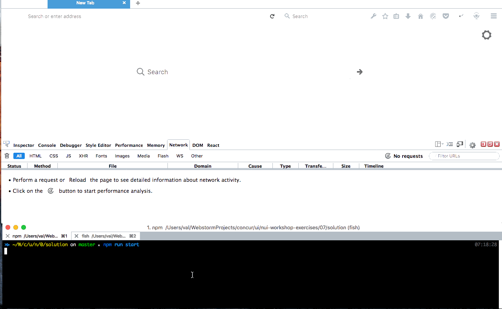

# NUI: bred & sandwich

## Tasks:
- Make application to show up inside of CTE navigation header and footer.
- Make Add Locations sessioned and Locations List session-less.

## Bonus - add assets fingerprinting



## Steps

#### - install packages
```
cd nui-workshop-exercises
npm install --save @concur/nui-logger react-transform-catch-errors
```


#### - change .babelrc

#### - change webpack.config.babel.rc
- add NuiConfigPlugin and NuiLoggerPlugin

#### - move routes to it's own file
- create src/routes.js and export routes you currently have defined in src/containers/Root.jsx

#### - change src/containers/Root.js
- export NuiClient component
- move rendering of <DevTools> to here


#### - modify src/configureStore.js
- import and apply nui-shell redux middlewares


### - modify src/reducers.js
- import nui-shell reducsers and pass them to final combineReducers call

#### - change src/server.js
- call initApp there

### - Change links
- in src/components/LocationsPage.jsx, make links to point to baseUrl

#### - remove staic/index.html
- remove index.html or any other means to render inital page of your app. initApp will take care about server side rendering and html generation and response.
